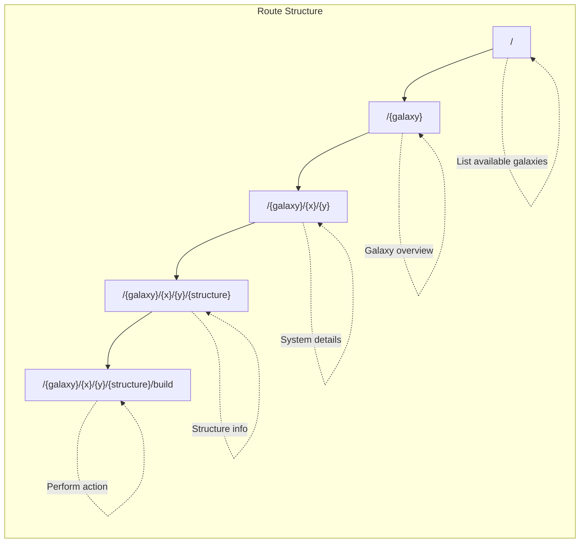
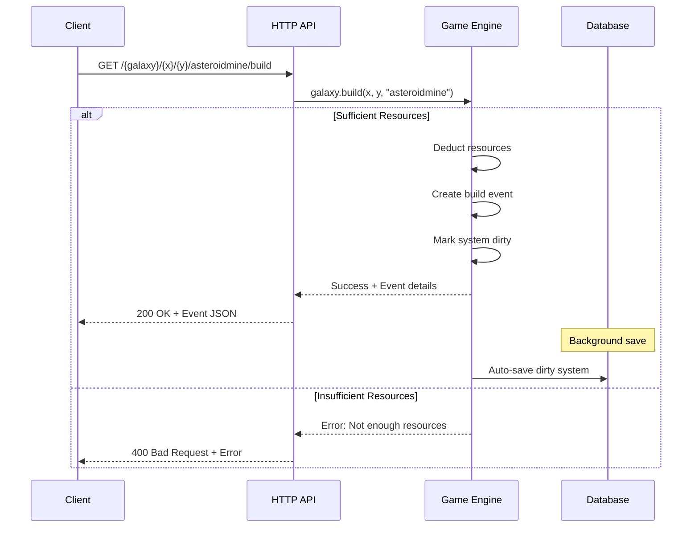
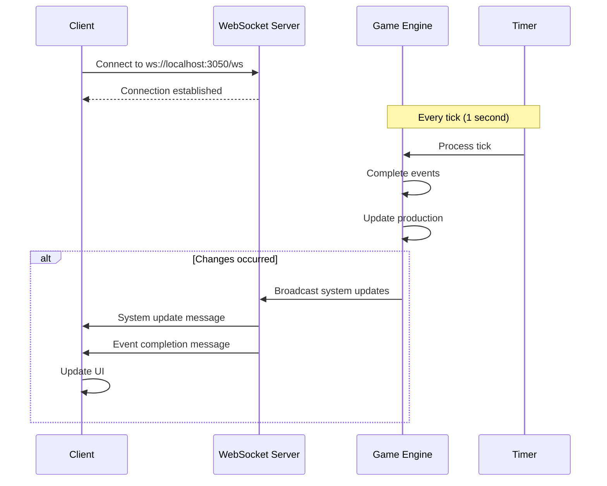
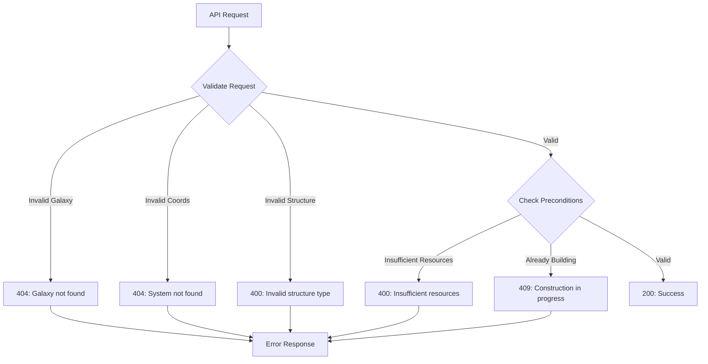

# API Reference

_This section documents the HTTP API for Galactic War._

## API Overview

Galactic War provides a REST API for programmatic access to all game functions. The API is designed to support both the web frontend and third-party applications.

### Base URL

```
# Development (default)
http://localhost:3050/

# Production (planned)
https://api.galactic-war.com/
```

### Quick Start

```bash
# Start the development server
task dev  # or: task run

# Server runs on http://localhost:3050
# Web interface available at root URL
```

### Authentication

_Authentication system is planned for future implementation._

## HTTP Routes

The API follows a REST-like pattern with the route structure: `/:galaxy/:x/:y[/:structure][/action]`



### Galaxy Management

#### Get Available Galaxies

```http
GET /
```

Returns a list of available galaxies and the main game interface.

#### Get Galaxy Information

```http
GET /{galaxy}
```

Returns overview information for a specific galaxy.

**Parameters:**

- `galaxy` - Galaxy name (e.g., "classic", "blitz")

## Core Endpoints

### Galaxy Information

#### Get Galaxy Stats

```http
GET /{galaxy}/stats
```

Returns overall galaxy statistics including player count, system information, and general metrics.

**Response:**

```json
{
  "players": 42,
  "systems": 200,
  "total_score": 15000,
  "active_events": 150
}
```

#### Get System List

```http
GET /{galaxy}/systems
```

Returns a list of all systems in the galaxy with basic information.

### System Operations

#### Get System Details

```http
GET /{galaxy}/{x}/{y}
```

Get detailed information about a specific system at coordinates (x, y).

**Parameters:**

- `x` - X coordinate of the system
- `y` - Y coordinate of the system

**Response:**

```json
{
  "coordinates": { "x": 50, "y": 75 },
  "resources": {
    "metal": 1250,
    "water": 890,
    "crew": 1100
  },
  "production": {
    "metal": 15,
    "water": 12,
    "crew": 10
  },
  "structures": {
    "colony": 3,
    "asteroidmine": 2,
    "waterharvester": 1
  },
  "events": [
    {
      "type": "construction",
      "completion": 1234567890,
      "structure": "hatchery"
    }
  ]
}
```

#### Build Structure

```http
GET /{galaxy}/{x}/{y}/{structure}/build
```

Note: This is a GET request that initiates building, following the current GET-only API design.



Start construction of a new structure or upgrade an existing one.

**Parameters:**

- `galaxy` - Galaxy name
- `x`, `y` - System coordinates
- `structure` - Structure type to build

**Response:**

```json
{
  "success": true,
  "event": {
    "completion": 1234567890,
    "type": "construction",
    "structure": "asteroidmine"
  }
}
```

### Structure Information

#### Get Structure Details

```http
GET /{galaxy}/{x}/{y}/{structure_type}
```

Get detailed information about a specific structure type in a system.

**Parameters:**

- `galaxy` - Galaxy name
- `x`, `y` - System coordinates
- `structure_type` - Type of structure (colony, asteroidmine, etc.)

**Response:**

```json
{
  "level": 2,
  "production": {
    "metal": 8,
    "water": 0,
    "crew": 0
  },
  "next_level_cost": {
    "metal": 15,
    "water": 15,
    "crew": 15,
    "time": 125
  }
}
```

## WebSocket API

Real-time updates are provided via WebSocket connections.



### Connection

```javascript
// Development
const ws = new WebSocket("ws://localhost:3050/ws");

// Production (planned)
const ws = new WebSocket("wss://api.galactic-war.com/ws");
```

### Event Types

#### System Updates

Sent when a system's state changes:

```json
{
  "type": "system_update",
  "system": { "x": 50, "y": 75 },
  "data": {
    "resources": { "metal": 1300, "water": 900, "crew": 1100 }
  }
}
```

#### Event Completion

Sent when an event completes:

```json
{
  "type": "event_complete",
  "system": { "x": 50, "y": 75 },
  "event": {
    "type": "construction",
    "structure": "asteroidmine",
    "new_level": 3
  }
}
```

## Error Handling



### Standard Error Response

```json
{
  "error": true,
  "message": "Insufficient resources",
  "code": "INSUFFICIENT_RESOURCES"
}
```

### Common Error Codes

- `INSUFFICIENT_RESOURCES` - Not enough resources for the requested action
- `SYSTEM_NOT_FOUND` - Invalid system coordinates
- `INVALID_STRUCTURE` - Unknown structure type
- `CONSTRUCTION_IN_PROGRESS` - Cannot build while another construction is active

## Rate Limiting

API requests are rate-limited to prevent abuse:

- **Standard Users:** 100 requests per minute
- **Authenticated Users:** 300 requests per minute (planned)
- **Bot Applications:** 1000 requests per minute (planned)

Rate limit headers are included in all responses:

```http
X-RateLimit-Limit: 100
X-RateLimit-Remaining: 95
X-RateLimit-Reset: 1234567890
```

## Future API Features

### Planned Endpoints

- Fleet management and movement
- Alliance operations
- User account management
- Real-time battle results
- Statistical data exports

### Advanced Features

- GraphQL API support
- Webhook notifications
- Bulk operations
- Historical data access
- Third-party application registration

_The API is actively being developed. More endpoints and features will be added as the game evolves._
