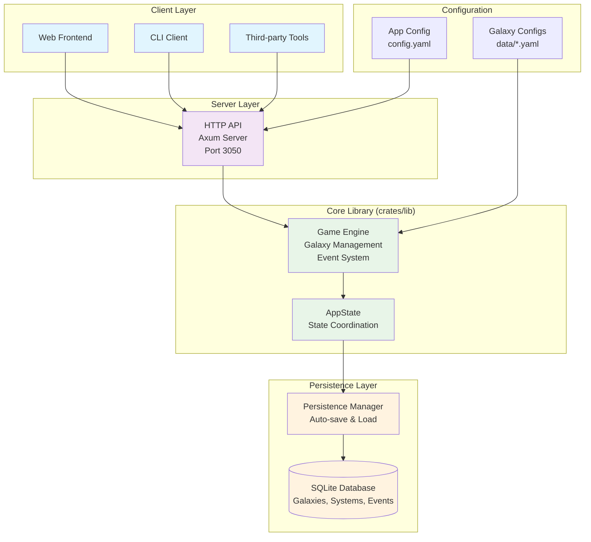
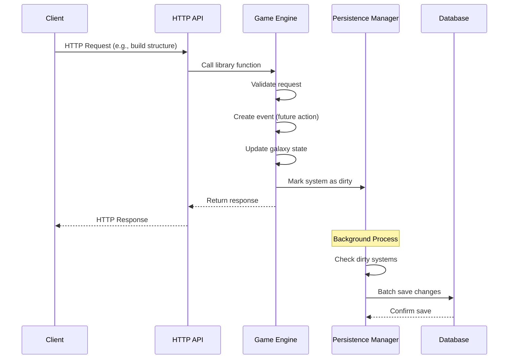
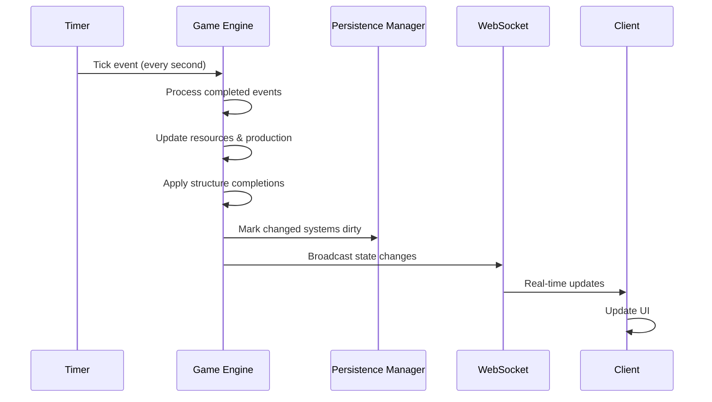
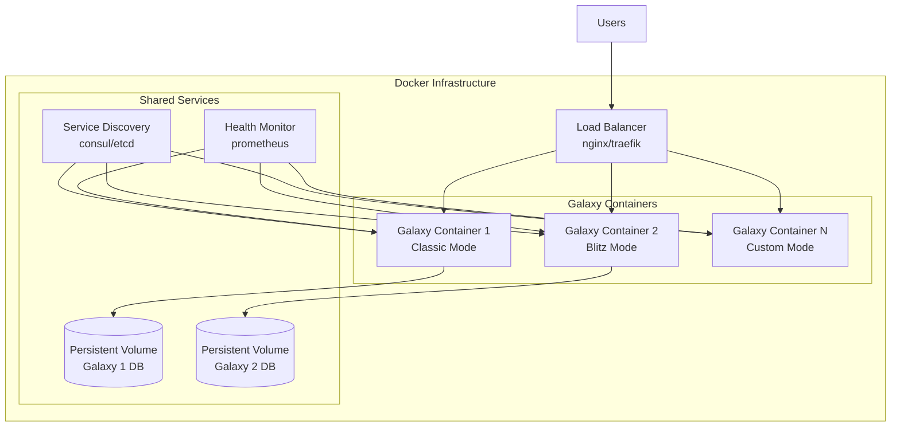

# Architecture

Galactic War is designed as a modular, high-performance system built in Rust. The architecture separates concerns between game logic, persistence, and presentation to enable flexible deployment and future expansion.

## System Overview



## Core Components

### Rust Library Crate (`crates/lib`)

The heart of the system is a pure Rust library that implements all game logic:

**Galaxy Management**

- `Galaxy` struct contains all game state
- `System` structs represent individual solar systems
- `Event` system handles all time-based actions
- Pure functions for deterministic gameplay

**Resource System**

- `Resources` struct for Metal/Water/Crew
- Production calculations and storage management
- Cost calculations for construction projects

**Configuration System**

- `GalaxyConfig` defines game rules and parameters
- `StructureConfig` defines building properties
- Fully customizable game mechanics

### Database Persistence (`app.rs`, `persistence.rs`, `db/`)

Real-time database persistence ensures data durability:

**AppState Management**

- Centralized application state with persistence lifecycle
- Automatic loading of galaxies from database when accessed
- Graceful degradation when database unavailable

**Background Persistence**

- Configurable auto-save intervals (default: 30 seconds)
- Write coalescing to batch multiple changes
- Dirty tracking to minimize database writes

**SQLite Integration**

- Complete schema for galaxies, systems, structures, and events
- Transactional batching for consistency
- Connection pooling for performance

### Binary Application Crate (`crates/bin`)

The server binary provides network access to the game library:

**HTTP Server (Axum)**

- REST API for all game operations
- WebSocket connections for real-time updates
- Static file serving for web frontend
- JSON-based communication protocol

**Multi-Galaxy Support**

- Each galaxy runs independently
- Configurable galaxy parameters
- Isolated game states

**Authentication System** (Planned)

- User account management
- Session handling
- Permission controls

### Web Frontend

Browser-based interface for game interaction:

**Single Page Application**

- Modern web technologies (HTML5, CSS3, JavaScript)
- Real-time updates via WebSocket
- Responsive design for mobile devices
- Intuitive user interface

## Design Principles

### Library-First Architecture

The core game logic is implemented as a library:

- **Embeddable** - Can be used in other Rust projects
- **Testable** - Pure functions enable comprehensive testing
- **Reusable** - Same logic for server, CLI, and future applications
- **Fast** - No network overhead for embedded use

### Event-Driven Design

All game activities are managed through an event system:

- **Deterministic** - Same inputs always produce same outputs
- **Replayable** - Full game history can be recreated
- **Serializable** - Events can be saved and restored
- **Debuggable** - Clear audit trail of all actions

### Configuration-Driven Gameplay

Game mechanics are defined in YAML configuration files:

- **Customizable** - Different galaxy types with unique rules
- **Moddable** - Easy to create custom game modes
- **Balanced** - Numerical tuning without code changes
- **Transparent** - All game mechanics are visible

### Performance Optimization

Designed for high performance and scalability:

- **Memory Efficient** - Entire galaxies fit in memory
- **CPU Efficient** - Minimal processing per tick
- **Network Efficient** - Optimized API design
- **Scalable** - Single-threaded per galaxy, multi-galaxy support

## Data Flow

### Game State Updates



### Real-Time Tick Processing



## File Structure

```
crates/
├── lib/                    # Library crate (galactic-war)
│   ├── Cargo.toml          # Library dependencies and config
│   ├── migrations/         # Database schema migrations
│   │   └── 001_initial_schema.sql
│   └── src/
│       ├── lib.rs          # Main library interface
│       ├── app.rs          # Application state management
│       ├── app_config.rs   # Application configuration
│       ├── config.rs       # Galaxy configuration structures
│       ├── game_system.rs  # Core game system logic
│       ├── persistence.rs  # Database persistence manager
│       ├── db/             # Database operations
│       │   ├── mod.rs
│       │   ├── events.rs
│       │   ├── galaxies.rs
│       │   ├── structures.rs
│       │   └── systems.rs
│       └── models/         # Data models
│           ├── mod.rs
│           ├── events.rs
│           ├── galaxy.rs
│           └── system.rs
└── bin/                    # Binary crate (galactic-war-bin)
    ├── Cargo.toml          # Binary dependencies and config
    └── src/
        └── main.rs         # HTTP server application

config.yaml                 # Application configuration
data/                       # Galaxy configuration files
docs/
└── src/                    # Documentation source files
```

## Future Architecture Plans

### Advanced Database Features

Enhance the existing persistence system:

- **PostgreSQL** for multi-server deployments and enhanced concurrency
- **Data Analytics** for query performance optimization and usage insights
- **Advanced Backup** with automated backups and point-in-time recovery
- **Compression** for historical events and archived galaxy data

### Microservices Architecture

Split components for better scaling:

- **Galaxy Service** - Individual galaxy management
- **User Service** - Authentication and account management
- **API Gateway** - Request routing and load balancing
- **WebSocket Service** - Real-time notification handling

### Container Deployment

Dockerized deployment for easy scaling:

```bash
# Build and run with Docker
task build:docker
task run:docker
```



- **Galaxy Containers** - One container per galaxy
- **Load Balancer** - Distribute traffic across instances
- **Service Discovery** - Automatic container coordination
- **Health Monitoring** - Automatic failure detection and recovery

### CLI and Desktop Applications

Expand beyond web-based access:

- **CLI Client** - Command-line galaxy management
- **Desktop Application** - Native cross-platform client
- **Mobile Apps** - iOS and Android applications
- **API Libraries** - SDKs for third-party development

This architecture provides a solid foundation for current gameplay while enabling future expansion and scaling as the game grows.
