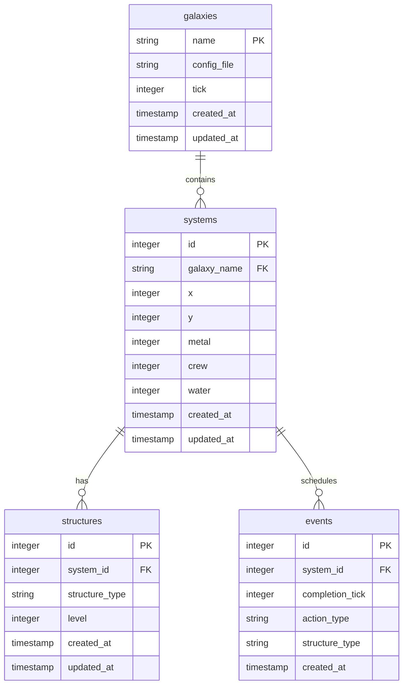

# Database Persistence

Galactic War implements a sophisticated database persistence system that automatically saves and loads galaxy state to ensure data durability. The system is designed for high performance with automatic background saves, change tracking, and graceful error handling.

## Overview

The persistence system provides:

- **Automatic Background Saves**: Configurable periodic persistence without blocking gameplay
- **Real-time State Tracking**: All changes are tracked and saved transparently
- **Graceful Degradation**: Continues operation if database is unavailable
- **Performance Optimization**: Write coalescing, connection pooling, and dirty tracking
- **Zero Downtime**: Galaxy operations continue during persistence operations

## Architecture

### Components


### Database Schema

The persistence layer uses SQLite with the following schema:



**Galaxies Table**

```sql
CREATE TABLE galaxies (
    name TEXT PRIMARY KEY,
    config_file TEXT NOT NULL,
    tick INTEGER NOT NULL DEFAULT 0,
    created_at TIMESTAMP DEFAULT CURRENT_TIMESTAMP,
    updated_at TIMESTAMP DEFAULT CURRENT_TIMESTAMP
);
```

**Systems Table**

```sql
CREATE TABLE systems (
    id INTEGER PRIMARY KEY AUTOINCREMENT,
    galaxy_name TEXT NOT NULL,
    x INTEGER NOT NULL,
    y INTEGER NOT NULL,
    metal INTEGER NOT NULL DEFAULT 0,
    crew INTEGER NOT NULL DEFAULT 0,
    water INTEGER NOT NULL DEFAULT 0,
    created_at TIMESTAMP DEFAULT CURRENT_TIMESTAMP,
    updated_at TIMESTAMP DEFAULT CURRENT_TIMESTAMP,
    FOREIGN KEY (galaxy_name) REFERENCES galaxies(name) ON DELETE CASCADE,
    UNIQUE(galaxy_name, x, y)
);
```

**Structures Table**

```sql
CREATE TABLE structures (
    id INTEGER PRIMARY KEY AUTOINCREMENT,
    system_id INTEGER NOT NULL,
    structure_type TEXT NOT NULL,
    level INTEGER NOT NULL DEFAULT 0,
    created_at TIMESTAMP DEFAULT CURRENT_TIMESTAMP,
    updated_at TIMESTAMP DEFAULT CURRENT_TIMESTAMP,
    FOREIGN KEY (system_id) REFERENCES systems(id) ON DELETE CASCADE,
    UNIQUE(system_id, structure_type)
);
```

**Events Table**

```sql
CREATE TABLE events (
    id INTEGER PRIMARY KEY AUTOINCREMENT,
    system_id INTEGER NOT NULL,
    completion_tick INTEGER NOT NULL,
    action_type TEXT NOT NULL,
    structure_type TEXT,
    created_at TIMESTAMP DEFAULT CURRENT_TIMESTAMP,
    FOREIGN KEY (system_id) REFERENCES systems(id) ON DELETE CASCADE
);
```

## Configuration

### Environment Variables

The persistence system is configured through environment variables:

| Variable                               | Default                  | Description                     |
| -------------------------------------- | ------------------------ | ------------------------------- |
| `DATABASE_URL`                         | `sqlite:galactic_war.db` | Database connection string      |
| `GWAR_PERSISTENCE_ENABLED`             | `true`                   | Enable/disable persistence      |
| `GWAR_PERSISTENCE_AUTO_SAVE_INTERVAL`  | `30`                     | Auto-save interval (seconds)    |
| `GWAR_PERSISTENCE_SHUTDOWN_TIMEOUT`    | `10`                     | Shutdown save timeout (seconds) |
| `GWAR_PERSISTENCE_WRITE_COALESCING`    | `true`                   | Enable write batching           |
| `GWAR_PERSISTENCE_COALESCING_DELAY_MS` | `1000`                   | Write coalescing delay (ms)     |

### Example Configuration

```bash
# Production with 60-second saves
DATABASE_URL=sqlite:production.db
GWAR_PERSISTENCE_AUTO_SAVE_INTERVAL=60
GWAR_PERSISTENCE_WRITE_COALESCING=true

# Development with frequent saves (or use task dev)
DATABASE_URL=sqlite:.cache/galactic-war/dev.db
GWAR_PERSISTENCE_AUTO_SAVE_INTERVAL=5
RUST_LOG=info
```

## Features

### Automatic Background Persistence

The `PersistenceManager` runs in the background, automatically saving dirty galaxies at configurable intervals:

```rust
// Configurable auto-save every 30 seconds (default)
PersistenceConfig {
    auto_save_interval: 30,
    enabled: true,
    // ... other settings
}
```


**How it works:**

1. Galaxy operations mark systems as "dirty" when modified
2. Background worker checks for dirty galaxies every interval
3. Dirty galaxies are saved to database in batched transactions
4. Clean galaxies are skipped to optimize performance

### Change Tracking

The system implements intelligent dirty tracking to minimize database writes:

```rust
// Galaxy struct tracks changes
pub struct Galaxy {
    // ... other fields
    dirty_systems: HashSet<Coords>,
    needs_persist: bool,
}

// Automatic dirty marking on changes
impl Galaxy {
    pub fn build(&mut self, ...) -> Result<Event, String> {
        // ... build logic
        if result.is_ok() {
            self.mark_system_dirty(coords);
        }
        result
    }
}
```

**Benefits:**

- Only modified systems are persisted
- Reduces database write volume
- Improves performance for large galaxies
- Maintains data consistency

### Write Coalescing

Multiple rapid changes are batched together to improve performance:


1. **Collection Phase**: Changes accumulate in memory
2. **Coalescing Delay**: Wait for additional changes (default: 1 second)
3. **Batch Write**: All changes saved in single transaction
4. **Optimization**: Reduces database load and improves throughput

### Auto-Loading

Galaxies are automatically loaded from the database when accessed:

```rust
// AppState automatically loads galaxies
pub async fn get_galaxy_details(&self, galaxy_name: &str, ...) -> Result<Details, String> {
    // Try memory first
    {
        let mut galaxies = GALAXIES.lock().unwrap();
        if let Some(galaxy) = galaxies.get_mut(galaxy_name) {
            return galaxy.get_details(tick, coords, structure);
        }
    }

    // Auto-load from database if not in memory
    if let Some(ref pm) = self.persistence_manager {
        pm.load_galaxy(galaxy_name).await?;
        // Now try memory again...
    }
}
```

### Graceful Error Handling

The system continues operating even if persistence fails:

1. **Database Unavailable**: Logs error, continues with in-memory state
2. **Disk Full**: Attempts save, continues operation on failure
3. **Corruption**: Falls back to in-memory mode
4. **Network Issues**: Retries with exponential backoff

## Performance Optimizations

### Connection Pooling

Uses SQLite connection pooling for efficient database access:

- Multiple concurrent operations
- Automatic connection lifecycle management
- Configurable pool size and timeouts

### Transactional Batching

All related changes are saved in single transactions:

- Atomic updates ensure consistency
- Reduces transaction overhead
- Improves write performance

### Memory Efficiency

- In-memory cache for active galaxies
- Lazy loading of inactive galaxies
- Automatic cleanup of unused data
- Minimal memory footprint per galaxy

## Usage Examples

### Basic Setup

```bash
# Start with default persistence
task run  # or: cargo run --bin galactic-war

# Development mode (recommended - creates persistent dev database)
task dev

# Custom database location
DATABASE_URL=sqlite:custom.db task run
```

### Development Mode

```bash
# Enable debug logging (task dev already includes good defaults)
RUST_LOG=info task dev

# Frequent saves for testing (task dev already uses 5-second interval)
GWAR_PERSISTENCE_AUTO_SAVE_INTERVAL=1 task dev
```

### Production Deployment

```bash
# Build optimized binary
task build  # or: cargo build --release --workspace

# Run with production settings
DATABASE_URL=sqlite:/data/galactic_war.db \
GWAR_PERSISTENCE_AUTO_SAVE_INTERVAL=60 \
./target/release/galactic-war

# Or use Docker for production
task build:docker
task run:docker
```

### Persistence Management

```rust
// Manual save all dirty galaxies
let count = app_state.save_all().await?;
println!("Saved {} galaxies", count);

// Graceful shutdown with final save
app_state.shutdown().await?;
```

## Testing

The persistence system includes comprehensive test coverage:

```bash
# Run all tests across workspace (includes persistence tests)
task test  # or: cargo nextest run --workspace

# Run tests for library crate only
task test:lib  # or: cargo nextest run -p galactic-war

# Database-specific tests
cargo nextest run -p galactic-war db::

# Integration tests
cargo nextest run -p galactic-war app::tests
```

### Test Infrastructure

- **In-Memory Databases**: Tests use `sqlite::memory:` for isolation
- **Test Fixtures**: Pre-configured galaxies and systems
- **Comprehensive Coverage**: 15 tests covering all major functionality
- **Performance Tests**: Verify save/load performance characteristics

## Monitoring and Debugging

### Logging

Enable detailed persistence logging:

```bash
RUST_LOG=galactic_war::persistence=debug task dev
```

**Log Events:**

- Galaxy creation and loading
- Auto-save operations
- Error conditions and recovery
- Performance metrics

### Metrics

The system tracks key performance indicators:

- Save operation duration
- Number of dirty systems persisted
- Database operation success/failure rates
- Memory usage of galaxy cache

### Troubleshooting

**Common Issues:**

1. **Database Locked**: Multiple processes accessing same SQLite file

   - Solution: Use unique database files or enable WAL mode

2. **Slow Performance**: Large galaxies with frequent changes

   - Solution: Increase auto-save interval or enable write coalescing

3. **Disk Space**: Database file grows over time
   - Solution: Implement periodic cleanup or database optimization

## Migration and Backup

### Database Migrations

The system uses SQLite migrations for schema updates:

```rust
// Automatic migration on startup
sqlx::migrate!("./migrations").run(&pool).await?;
```

### Backup Strategies

**Simple Backup**:

```bash
# Copy database file
cp galactic_war.db galactic_war_backup.db
```

**Online Backup**:

```sql
-- SQLite online backup
.backup backup.db
```

**Automated Backup**:

```bash
# Cron job for daily backups
0 2 * * * cp /data/galactic_war.db /backups/galactic_war_$(date +\%Y\%m\%d).db
```

## Future Enhancements

### PostgreSQL Support

- Multi-server deployments
- Enhanced concurrency
- Advanced replication features

### Compression

- Compress historical events
- Archive old galaxy data
- Reduce storage requirements

### Analytics

- Query performance optimization
- Data usage analytics
- Predictive caching

The database persistence system provides a solid foundation for data durability while maintaining the high performance characteristics required for real-time gameplay.
