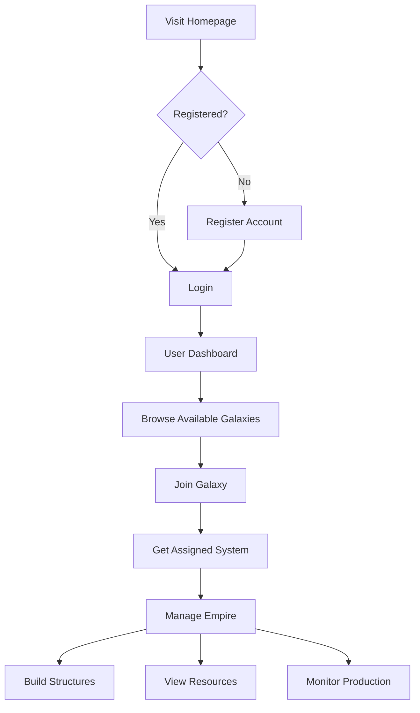

# User Accounts Overview

Galactic War supports user accounts that allow players to register, authenticate, and manage their galactic empires across multiple galaxies. The user account system provides secure authentication, session management, and per-galaxy account isolation.

## Core Concepts

### Server-Level Users

Every player has a **server-level user account** with:

- Unique username and email
- Secure password authentication
- Session-based login management

### Galaxy-Specific Accounts

Within each galaxy, users have **galaxy-specific accounts** that include:

- Display name (unique within the galaxy)
- Join timestamp and activity tracking
- Ownership of systems within that galaxy

### System Ownership

- Each user can own **one system per galaxy**
- Systems are automatically generated when joining a galaxy
- Users can only build/manage structures in systems they own

## User Workflow

## Account Features

### Authentication

- **Registration**: Username, email, password with validation
- **Login**: Support for both username and email authentication
- **Sessions**: 24-hour session expiry with automatic cleanup
- **Logout**: Secure session termination

### Multi-Galaxy Support

- Users can join multiple galaxies
- Each galaxy maintains separate accounts and systems
- Unified dashboard shows all galaxy accounts
- Per-galaxy activity tracking

### Security

- Password hashing with Argon2id
- HTTP-only session cookies
- Session validation on protected routes
- Automatic expired session cleanup

## Access Control

### Public Access

- Browse galaxy statistics (read-only)
- View system information without modification
- Create new galaxies

### Authenticated Access

- Personal dashboard with account management
- Join galaxies and get assigned systems
- Build and upgrade structures
- Manage empire resources

### Ownership-Based Access

- Users can only modify systems they own
- Building/upgrading requires system ownership
- Resource management restricted to owned systems

## Database Schema

### Users Table

- `id`: Primary key
- `username`: Unique username
- `email`: Unique email address
- `password_hash`: Argon2id hash
- `created_at`, `updated_at`: Timestamps

### User Galaxy Accounts Table

- `id`: Primary key
- `user_id`: Reference to users table
- `galaxy_name`: Reference to galaxies table
- `account_name`: Display name (unique per galaxy)
- `joined_at`, `last_active`: Activity timestamps
- Unique constraint: (user_id, galaxy_name)

### User Sessions Table

- `id`: Session token (primary key)
- `user_id`: Reference to users table
- `expires_at`: Session expiration
- `created_at`: Session creation timestamp

### System Ownership

- Systems table includes `user_galaxy_account_id`
- Links systems to specific galaxy accounts
- Enables ownership-based access control
